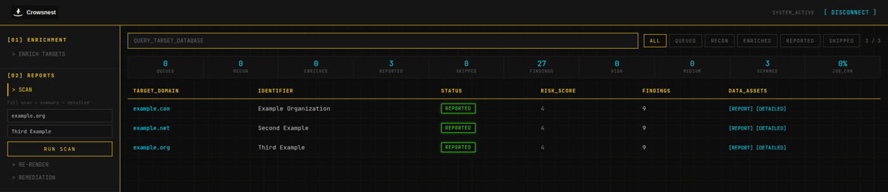

# Crowsnest

Passive reconnaissance orchestrator. It takes a list of domains, runs
containerised OSINT tooling against them, enriches the findings with LLM
agents, and renders a technical assessment report — with a web dashboard that
streams every job's output live.

Nothing it does touches the target: no exploitation, no authentication
attempts, no traffic beyond what an ordinary visitor generates.

The public version keeps the engineering and drops the business. What
remains is the part that was interesting to build.

## Example output



[`examples/sample_report.pdf`](examples/sample_report.pdf) — a full report
generated against a fictitious target with the OWASP Top 10 framework active:
executive summary, risk scenarios, findings table with severity, per-finding
evidence, prioritised remediation plan with effort estimates, and the
compliance control mapping.

[`examples/sample_target.json`](examples/sample_target.json) — the target
schema, with entirely fictitious entries.

## Quick start

```bash
git clone https://github.com/GrpX/crowsnest.git crowsnest && cd crowsnest

cp .env.example .env                                    # API keys, all optional
cp config/provider-config.example.yaml \
   config/provider-config.yaml                          # subfinder providers

docker compose build                                    # builds crowsnest:latest

mkdir -p targets && printf 'example.com\nexample.org\n' > targets/domains.txt
./crowsnest.sh recon                                    # score domains, no Docker
./crowsnest.sh report example.com "Example"             # full scan → report JSON
./crowsnest.sh webapp                                   # dashboard on :5000
```

Every API key is optional: without them the recon stage simply queries fewer
sources. Without an LLM backend the enrichment stage is skipped and the
report is generated without its narrative summary — the PDF still renders.

Full install in [`SETUP.md`](SETUP.md); the agent layer in
[`openclaw/README.md`](openclaw/README.md); adding a compliance framework in
[`config/compliance/README.md`](config/compliance/README.md).

### Commands

| Command | What it does |
|---|---|
| `./crowsnest.sh recon` | Score domains with checkdmarc. No Docker required. |
| `./crowsnest.sh report <domain> "<name>"` | Full containerised scan → report JSON |
| `./crowsnest.sh diagnostico` | Re-render the detailed report from the latest session |
| `./crowsnest.sh trabajo` | Full pipeline against an authorised target |
| `./crowsnest.sh batch [list.txt]` | Process a domain list in parallel |
| `./crowsnest.sh targets enriquecer [list.txt]` | Run the LLM enrichment agents |
| `./crowsnest.sh webapp` | Start the dashboard |

## Scope

What it produces: indicators of exposure gathered from public sources —
DNS records, certificate and header data, indexed subdomains, DMARC/SPF
posture, technology fingerprints, and CVE matches from `nuclei` templates.
These are indicators, not confirmation by exploitation; nothing in the
pipeline verifies a finding by acting on the target.

What it needs: Docker, to run the containerised recon tools. An LLM backend
is optional — without one, the enrichment and executive-summary stages are
skipped and the report still renders (see `scripts/nuclei_to_report.py` and
the smoke test that covers this path).

What runs without credentials: `subfinder`, `httpx`, `whatweb` and
`checkdmarc` work with no API keys. The OSINT provider keys in
`.env.example` (Shodan, Censys, GitHub, Chaos, SecurityTrails, BinaryEdge,
VirusTotal, FullHunt, ZoomEye) are optional and widen subdomain coverage —
they do not gate any functionality.

## Background

Crowsnest began as internal tooling at a small infosec company — the
pipeline that took a domain from initial reconnaissance to a finished
assessment report. That origin explains two things a general-purpose
recon framework wouldn't carry: a report generator that produces
client-ready documents instead of raw output, and a compliance mapping
layer, because those reports had to speak the language of whatever
regulation the reader answered to.

## How it works

### Pipeline

```
domains.txt
    │
    ▼
┌─────────────┐   subfinder · httpx · nuclei · checkdmarc · whatweb · nmap
│    recon    │   containerised, results written per session
└──────┬──────┘
       ▼
┌─────────────┐   3 LLM agents: triage, discovery, summary
│  enrichment │   optional — the pipeline runs without a backend
└──────┬──────┘
       ▼
┌─────────────┐   findings → severity → compliance controls → effort
│   report    │   Jinja2 + WeasyPrint → PDF
└──────┬──────┘
       ▼
┌─────────────┐   job lifecycle, findings by severity, live log stream
│  dashboard  │   Flask + SSE
└─────────────┘
```

A target moves through `queued → recon → enriched → reported`, with `skipped`
as the branch for domains the prefilter rejects. Those five states are
declared once, in `lib/states.py`, and every consumer — shell heredocs,
Python modules, the web API and the frontend — reads them from there.

### Stack

Python · Docker Compose · Flask + SSE · Jinja2 + WeasyPrint · Crawl4AI ·
an Ollama-compatible LLM endpoint.

Recon tooling runs inside the container: subfinder, httpx, nuclei,
checkdmarc, whatweb, nmap, amass.

### Layout

```
crowsnest.sh            CLI entry point
lib/                    states, branding, revision — shared by every consumer
config/
  compliance/           one file per compliance framework
  provider-config.example.yaml
scripts/
  audit.sh              recon inside the container
  nuclei_to_report.py   findings → structured report JSON
  generate_pdf.py       report JSON → PDF
openclaw/               LLM agent layer (see its README)
templates/              report template + wordmark
webapp/                 Flask dashboard, SSE log streaming
examples/               sample report and target schema
docs/                   tooling evaluation and design decisions
```

## Pluggable by design

Three unrelated concerns follow the same pattern: a directory of declarative
config, selected at runtime, with nothing about the choice compiled in.

| Concern | Declared in | Selected by |
|---|---|---|
| OSINT providers | `config/provider-config.example.yaml` | copy to `config/provider-config.yaml`, add keys |
| LLM backend | `openclaw/config.json` → `llm` | `LLM_BASE_URL`, `CROWSNEST_MODEL_<AGENT>` |
| Compliance mapping | `config/compliance/*.yaml` | `--compliance <id>` or `CROWSNEST_COMPLIANCE_FRAMEWORK` |

**No model name appears anywhere in the code.** Agents resolve their model
from config with an environment override, and the test suite asserts that
each agent declares *some* model available in the configured backend — never
that it is a particular one. Local models age fast; swapping one is a config
edit, not a patch.

The same holds for compliance. A framework file declares an id, a name and a
mapping from finding tag to control; the report renders whatever it declares.
The bundled example is OWASP Top 10 because it is a public taxonomy that
needs no legal interpretation. If several frameworks are present and none is
selected, the engine exits and lists them rather than guessing which one a
report was written against.

That indirection exists for a concrete reason. The pipeline was originally
built against one jurisdiction's regulation, hardcoded through the report
templates — two near-duplicate templates whose only real difference was
which statute they cited. Making the mapping a config file collapsed them
into one and removed the assumption that the reader's obligations are
knowable from the code. Jurisdiction is an input here, not a scope.

## Design constraints — why passive-only

Crowsnest never touches the target. Every collection path resolves against
public records, third-party indexes, and DNS — never against the target's
own infrastructure. No port scans, no fuzzing, no authentication attempts,
no takeover verification.

This is a legal constraint expressed in architecture, not a gap in the
tooling.

Reconnaissance sits on either side of a line that most jurisdictions draw
in similar terms: reading what is already published is not unauthorized
access; probing a system to see how it responds usually is. Chile — where
this pipeline was built — draws that line in Ley 21.459, and Ley 21.663
art. 55 added a safe harbor for good-faith vulnerability research. The
safe harbor is instructive precisely because of how narrow it is. It
requires, among seven conditions, that the researcher be registered with
the national cybersecurity agency, that the agency be notified in advance,
that findings go to the system owner, and that nothing be published
unilaterally. Its sixth condition is the decisive one: the exemption
covers state systems. For everything else, the system owner's consent is
required.

No tool can satisfy those conditions on its operator's behalf. Consent is
the hinge, and consent is not a runtime flag.

So the boundary is drawn where it can actually be enforced — in what the
code is capable of doing. A pipeline that cannot probe cannot be
misconfigured into probing, and cannot be argued into it by an operator in
a hurry. The cost is real: passive collection yields indicators, not
confirmations. A finding here means an asset is exposed or a control is
absent, never that a vulnerability was exploited. Reports are written to
say exactly that.

Operators with written authorization from the system owner are in a
different position, and active verification is a legitimate next step for
them. That step belongs in a different tool.

[`docs/tooling-decisions.md`](docs/tooling-decisions.md) records where that
line fell in practice: which reconnaissance tools were evaluated, which were
rejected for requiring an authenticated session, and which was left out
because it fingerprints the target's hosts rather than only reading public
DNS. The constraint has already cost this pipeline a tool it wanted and
reduced another to half its capability.

## What is not in this repository

Real target data, scan results and generated reports stay out: `db/`,
`targets/` and `reports/` are ignored, as is any provider config holding
real keys. The tracked provider config is an empty `.example` template.

## License

MIT — see [`LICENSE`](LICENSE).
